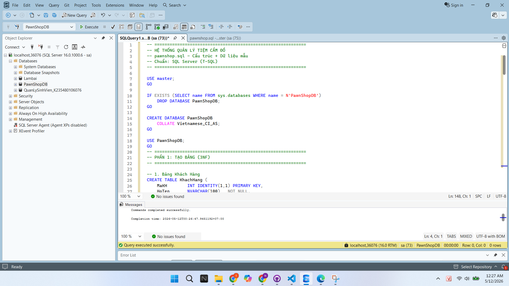
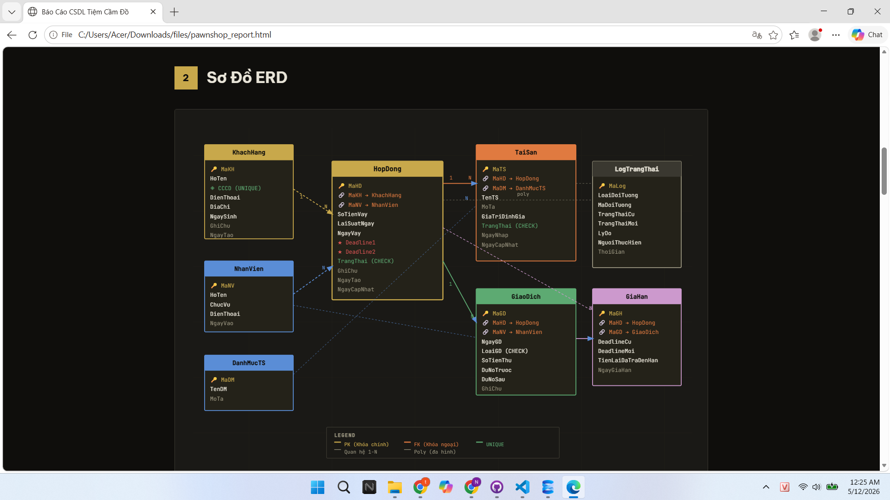
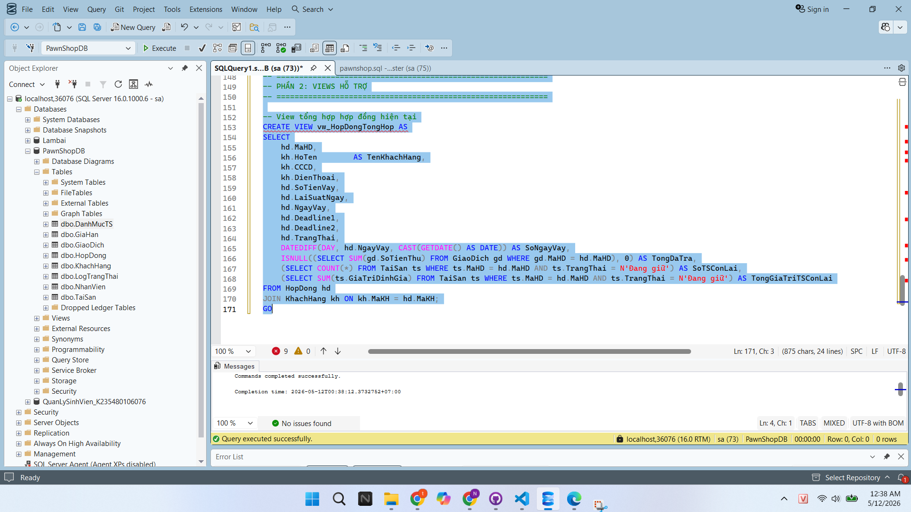
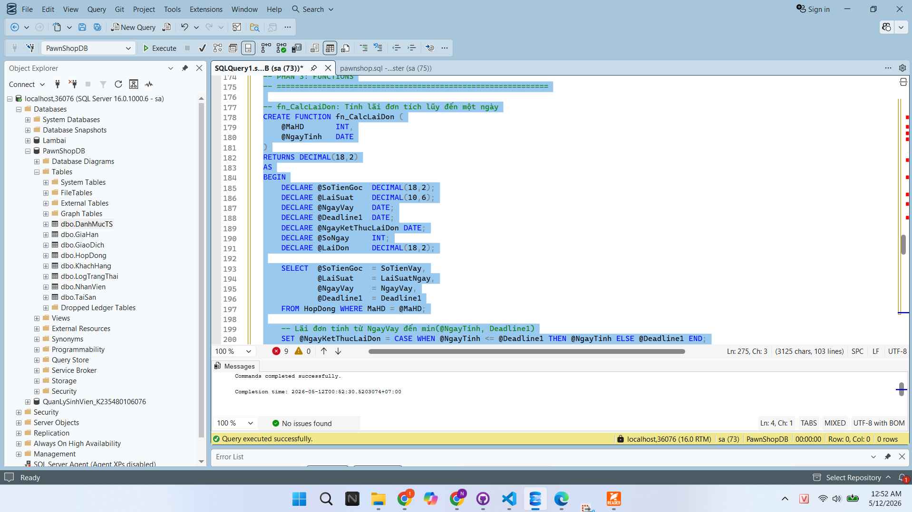
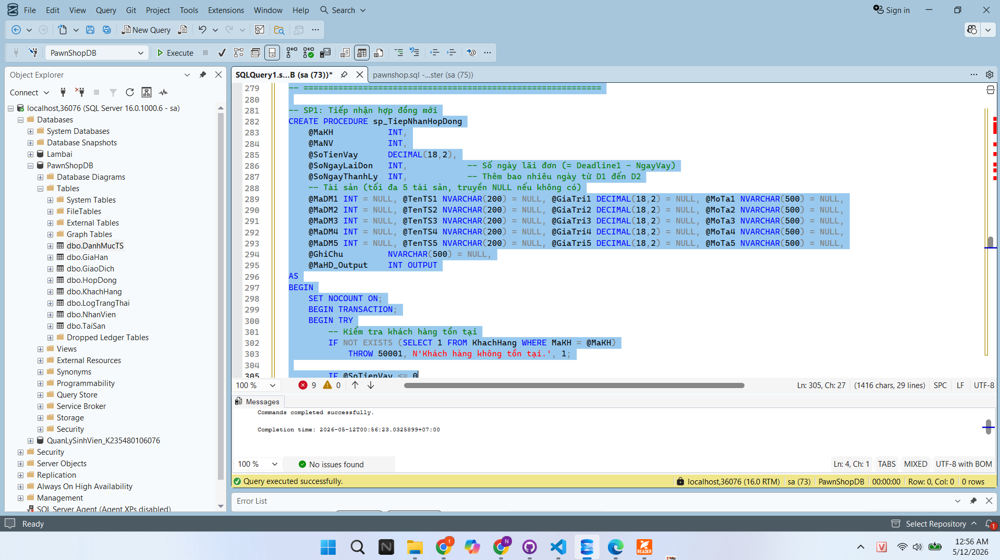
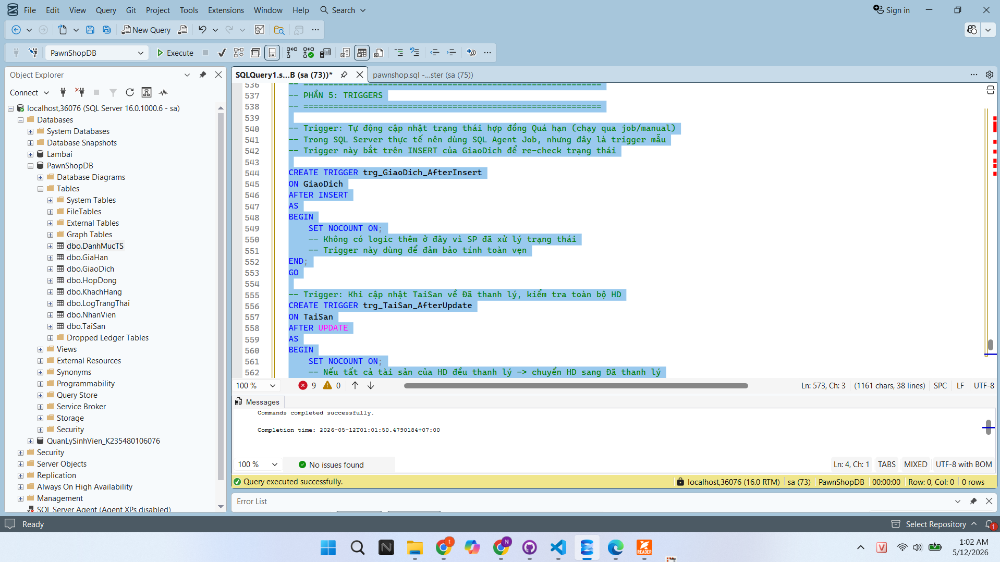
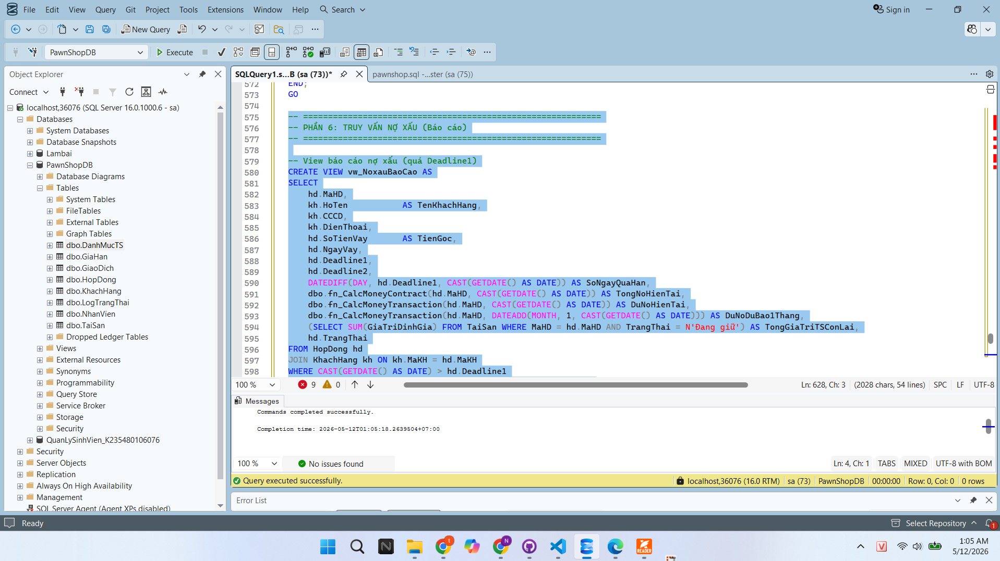
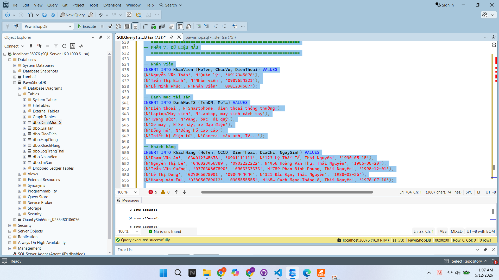

# BÀI KIỂM TRA SỐ 3 – QUẢN LÝ Tiệm Cầm Đồ 

## Thông tin cá nhân
| Thông tin | Chi tiết |
|---|---|
| **Họ tên** | Nghiêm Văn Tuấn  |
| **Mã sinh viên** | K235480106076 |
| **Chủ đề** | Quản lý Tiệm cầm đồ  |

Nhiệm vụ 1 : Thiết kế CSDL.

Bước 1: Tạo Database , tạo bảng



Bước 2: vẽ bảng ERD.



## 🗂️ Sơ đồ ERD (tóm tắt)

```
KhachHang (1) ──── (N) HopDong (1) ──── (N) TaiSan
                       │
                       ├── (N) GiaoDich
                       └── (N) GiaHan

NhanVien ──── FK ──── HopDong, GiaoDich
DanhMucTS ──── FK ──── TaiSan
LogTrangThai ──── (poly) ──── HopDong, TaiSan
```
## 📋 Các bảng chính

| Bảng | Chức năng |
|---|---|
| `KhachHang` | Thông tin khách vay |
| `NhanVien` | Nhân viên tiếp nhận / thu tiền |
| `DanhMucTS` | Danh mục loại tài sản |
| `HopDong` | Hợp đồng vay thế chấp |
| `TaiSan` | Tài sản thế chấp trong mỗi HĐ |
| `GiaoDich` | Lịch sử thu tiền (Audit) |
| `GiaHan` | Lịch sử gia hạn deadline |
| `LogTrangThai` | Log mọi thay đổi trạng thái |

NHIỆM VỤ 2: Cài Đặt SQL

## Event 1: Đăng ký hợp đồng mới (Vay tiền).

Viết Store Procedure tiếp nhận hợp đồng: Lưu thông tin khách hàng, danh sách tài sản (kèm giá trị định giá), số tiền vay gốc và thiết lập 2 mốc Deadline1, Deadline2.



Chú thích :Ảnh này cho thấy em đã tạo hợp đồng mới (VAY TIỀN) thành công.

CREATE VIEW vw_HopDongTongHop AS
SELECT
    hd.MaHD,
    kh.HoTen        AS TenKhachHang,
    kh.CCCD,
    kh.DienThoai,
    hd.SoTienVay,
    hd.LaiSuatNgay,
    hd.NgayVay,
    hd.Deadline1,
    hd.Deadline2,
    hd.TrangThai,
    DATEDIFF(DAY, hd.NgayVay, CAST(GETDATE() AS DATE)) AS SoNgayVay,
    ISNULL((SELECT SUM(gd.SoTienThu) FROM GiaoDich gd WHERE gd.MaHD = hd.MaHD), 0) AS TongDaTra,
    (SELECT COUNT(*) FROM TaiSan ts WHERE ts.MaHD = hd.MaHD AND ts.TrangThai = N'Đang giữ') AS SoTSConLai,
    (SELECT SUM(ts.GiaTriDinhGia) FROM TaiSan ts WHERE ts.MaHD = hd.MaHD AND ts.TrangThai = N'Đang giữ') AS TongGiaTriTSConLai
FROM HopDong hd
JOIN KhachHang kh ON kh.MaKH = hd.MaKH;
GO

## Event 2: Tính toán công nợ thời gian thực

Viết một Function fn_CalcMoneyTransaction(TransactionID, TargetDate) để tính số tiền phải trả của TransactionID này cho đến ngày TargetDate. Viết một Function fn_CalcMoneyContract(ContractID, TargetDate) để tính tổng số tiền khách(ContractID) phải trả (Gốc + Lãi đơn + Lãi kép) tính đến ngày TargetDate. Gợi ý: SV cần sử dụng hàm tính lũy thừa hoặc vòng lặp để xử lý lãi kép.



Chú thích : Ảnh này cho thấy e đã tạo thành công.

## Event 3 : Xử lý trả nợ và hoàn trả tài sản.

Viết Viết Store Procedure xử lý khi khách mang tiền đến: Nếu tài sản đã bị thanh lý (sau Deadline 2 và có cờ IsSold): Thông báo không thu tiền, không trả đồ. Nếu tài sản chưa bị thanh lý: Tính tổng nợ, trừ số tiền khách trả vào hệ thống. Nếu trả hết tiền, trả hết đồ và cập nhật trạng thái hợp đồng thành “Đã thanh toán đủ”; Nếu chưa trả hết tiền gốc+lãi: cập nhật trạng thái hợp đồng thành “Đang trả góp”, ghi nhận vào LOG số tiền đã trả, và số tiền còn nợ. Đưa ra danh sách gợi ý trả lại cho khách hàng này dựa trên điều kiện: Giá trị tài sản còn lại >= Dư nợ còn lại.



Chú thích : Tạo bảng xử lý trả nợ và hoàn trả tài sản thành công.

## Event 4: Truy vấn danh sách nợ xấu (Nợ khó đòi)

Xuất danh sách các khách hàng đã quá Deadline 1 mà chưa thanh toán. Yêu cầu các cột: Tên KH, Số điện thoại, Số tiền vay gốc, Số ngày quá hạn, Tổng tiền phải trả hiện tại (đến ngày hiện tại), Tổng số tiền phải trả sau 1 tháng nữa. Gợi ý: Nên viết function hỗ trợ. Bước 1 : Viết FUNCTION tính tổng tiền phải trả.



Chú thích : Ảnh này cho thấy e đã tạo thành công.

## Event 5: Quản lý thanh lý tài sản

Viết một Trigger tự động chuyển trạng thái hợp đồng sang "Quá hạn (nợ xấu)" sau khi hợp đồng đang ở trạng thái "Đang vay" mà ngày vượt quá Deadline 1. Viết một Trigger tự động chuyển trạng thái tài sản sang "Sẵn sàng thanh lý" sau khi hợp đồng đang ở trạng thái "Quá hạn (nợ xấu)" mà ngày vượt quá Deadline 2. Viết một Trigger tự động chuyển trạng thái tài sản thành “Đã bán thanh lý” sau khi trạng thái của hợp đồng chuyển sang "Đã thanh lý". Chú ý: Mỗi tài sản cũng được theo dõi trạng thái: đang cầm cố, đã trả khách, đã bán thanh lý.



Chú thích : Tạo bảng xử lý trả nợ và hoàn trả tài sản thành công.

## 📊 Dữ liệu mẫu

| MaHD | Khách hàng | Tiền vay | Trạng thái |
|---|---|---|---|
| 1 | Phạm Văn An | 5.000.000đ | Đang vay |
| 2 | Nguyễn Thị Bé | 10.000.000đ | **Quá hạn** |
| 3 | Trần Văn Cường | 3.000.000đ | Đã thanh toán |
| 4 | Lê Thị Dung | 15.000.000đ | **Quá hạn** |
| 5 | Hoàng Văn Em | 8.000.000đ | Đang vay |


